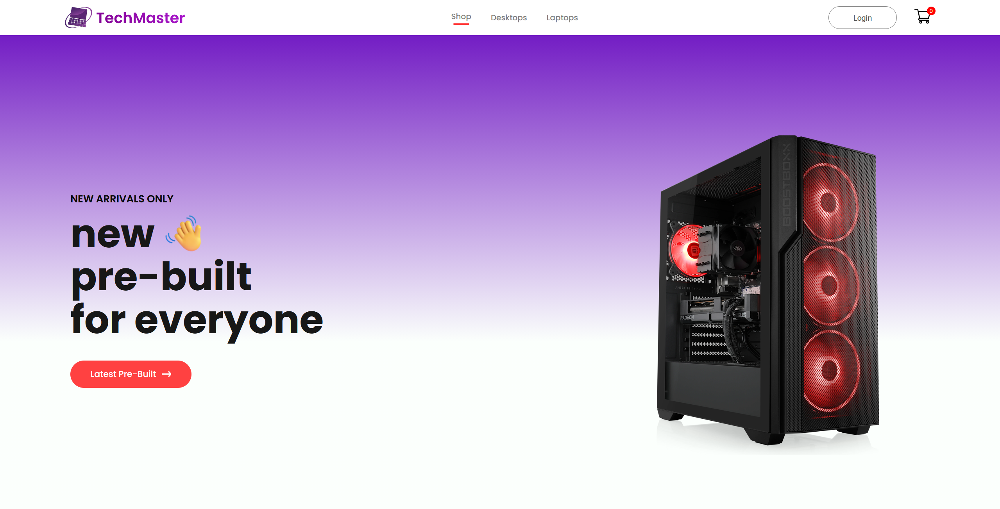

# MERN Ecommerce

## Description

An e-commerce website built with MERN stack centered around selling desktops and laptops. The main implementations are the following:

1. Users can view all products
2. Users can view single product
3. Users can add products to cart
4. Users can register & sign in
5. Admin can create & delete products



### Features:

  * React powers the interactive user interface for both the customer storefront and the admin panel
  * Node runtime environment hosts the server and processes API requests
  * Express manages HTTP requests, defines API endpoints, and connects the frontend to the database
  * Multer intercepts image uploads from the frontend and saves them safely to the server
  * Mongoose creates data schemas and translates the server code into database commands

## Install

1. #### Clone the repo using this command
   ```bash
   git clone https://github.com/SanchoWrites/mern-ecommerce.git
   ```
2. Install backend packages
   ```bash
   cd Backend
   npm install
   ```
3. Install frontend packages
   ```bash
   cd Frontend
   npm install
   ```
4. Install admin packages
   ```bash
   cd Admin
   npm install
   ```
5. Set up mongodb atlas database
   1. Create an atlas account
   2. Deploy a cluster
   3. In your cluster, click on Connect, choose the Drivers and Client Libraries option, select language JavaScript and client library Node.js Driver, turn on legacy URL string and copy the link
   4. Go to index.js inside the Backend folder and paste the link inside mongoose.connect(). Make sure to include your password inside the link
  ```bash
   mongoose.connect("mongodb://<USERNAME>:<PASSWORD>@ac-pdhehzc-shard-00-00.mqc0sj9.mongodb.net:27017,ac-pdhehzc-shard-00-01.mqc0sj9.mongodb.net:27017,ac-pdhehzc-shard-00-02.mqc0sj9.mongodb.net:27017/?ssl=true&replicaSet=atlas-c6mmvf-shard-0&authSource=admin&appName=Cluster0")
   ```
6. Run the backend
   ```bash
   cd Backend
   node index.js
   ```
7. Run the frontend
   ```bash
   cd Frontend
   npm start
   ```
